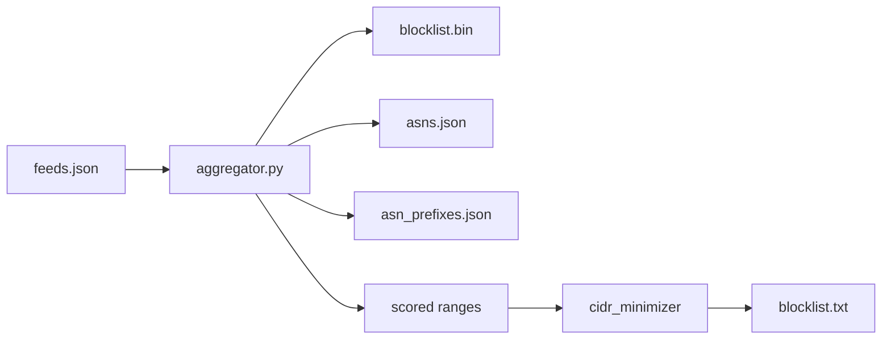
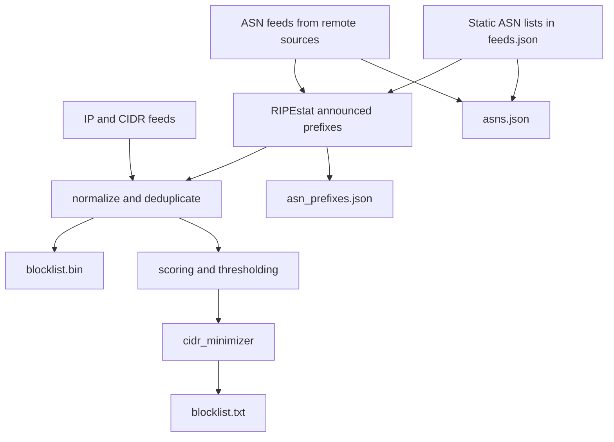

<div align="center">

# IPBlocklist

<p align="center">


</p>

</div>

IPBlocklist aggregates IP and ASN threat intelligence into five release
artifacts:

- `blocklist.bin`: compact binary data for application lookups (legacy
  IPBL v2 with scoring + categories)
- `blocklist.txt`: scored, CIDR-minimized text blocklist for firewalls
- `intel.bin`: SoA columnar binary built by the Rust `builder/` crate
  from `feeds-intel.json`: mmap-friendly, flag-bitmask data model, no
  scoring/categories, ~30 MB, 153 feeds, 20 flags
- `asns.json`: normalized ASN lists keyed by feed name
- `asn_prefixes.json`: cached ASN → announced prefixes

The current dataset is built from 163 feeds and includes IPv4, IPv6, CIDR
ranges, announced prefixes derived from ASN feeds, and proxy-type ranges from
IP2X.

The feed set includes OXL risk-db-lists sources for hosting, crawlers, VPNs,
scanners, proxies, Tor, ISP, education, dynamic, and top-reported reputation
lists across ASN, network, and IP scopes.

## Demo

A live lookup page is available at
[ipblocklist.tn3w.dev](https://ipblocklist.tn3w.dev). It loads
`blocklist.bin`, `feeds.json`, `asns.json`, and `asn_prefixes.json` client-side
and supports IP and ASN queries with detailed results, feed metadata tooltips,
score visualization, and announced prefix listings per ASN.

For a minimal, highly optimized API server see
[tn3w/ipblocklist-api](https://github.com/tn3w/ipblocklist-api):

```bash
curl https://ipblocklist-api.tn3w.dev/lookup/1.2.3.4
```

```json
{
  "ip": "1.2.3.4",
  "max_score": 0.81,
  "top_category": "spam",
  "categories": ["malware", "spam"],
  "flags": ["is_spammer", "is_phishing"],
  "feeds": ["hphosts_psh", "hphosts_fsa"]
}
```

## Downloads

```bash
wget https://github.com/tn3w/IPBlocklist/releases/latest/download/blocklist.bin
wget https://github.com/tn3w/IPBlocklist/releases/latest/download/blocklist.txt
wget https://github.com/tn3w/IPBlocklist/releases/latest/download/asns.json
wget https://github.com/tn3w/IPBlocklist/releases/latest/download/asn_prefixes.json
```

## Visualizations





## Pipeline

`aggregator.py` downloads feeds, resolves ASNs to prefixes via RIPEstat, merges
overlapping ranges, and writes `blocklist.bin`, `asns.json`, and `blocklist.txt`.

Feeds marked `is_asn` support remote (`url` + `regex`) or static (`asns`) input.
Use `base_score: 0.0` to include an ASN feed in `blocklist.bin`/`asns.json`
without affecting `blocklist.txt`.

## Artifacts

### `blocklist.bin`

Self-describing binary format (v2) for fast lookups. No external JSON needed.

```text
[4 bytes: magic "IPBL"]
[1 byte: version (2)]
[4 bytes: timestamp (unix, LE)]
[1 byte: flag count]
for each flag:
  [1 byte: name length]
  [N bytes: flag name (utf-8)]
[1 byte: category count]
for each category:
  [1 byte: name length]
  [N bytes: category name (utf-8)]
[2 bytes: feed count (LE)]
for each feed:
  [1 byte: feed name length]
  [N bytes: feed name (utf-8)]
  [1 byte: base_score (0-200, divide by 200.0)]
  [1 byte: confidence (0-200, divide by 200.0)]
  [4 bytes: flags bitmask (LE, bit i = flag at index i)]
  [1 byte: categories bitmask (bit i = category at index i)]
  [4 bytes: range count (LE)]
  for each range:
    [varint: start delta from previous start]
    [varint: range size (end - start)]
```

Flags and categories are stored as string tables followed by bitmasks per feed,
keeping the format compact and fully self-contained.

See the `examples/` directory for lookup implementations in many languages.

### `blocklist.txt`

Text blocklist generated from scored ranges after thresholding, CIDR promotion,
and non-routable range removal.

Supported output forms:

- Single IPv4: `1.2.3.4`
- IPv4 CIDR: `1.2.3.0/24`
- IPv4 range: `1.2.3.1-1.2.3.254`
- Single IPv6: `2001:db8::1`
- IPv6 CIDR: `2001:db8::/32`
- IPv6 range: `2001:db8::1-2001:db8::ff`

### `intel.bin`

Built by `builder/` (Rust). Source: `feeds-intel.json`. No magic header,
SoA columnar layout, mmap-friendly. 128-byte header (little-endian
throughout):

| offset | size | field         |
| ------ | ---- | ------------- |
| 0      | u32  | version (4)   |
| 4      | u32  | reserved      |
| 8      | u64  | v4_count      |
| 16     | u64  | v6_count      |
| 24     | u64  | val_count     |
| 32     | u64  | str_count     |
| 40     | u64  | v4_starts_off |
| 48     | u64  | v4_ends_off   |
| 56     | u64  | v4_vals_off   |
| 64     | u64  | v6_starts_off |
| 72     | u64  | v6_ends_off   |
| 80     | u64  | v6_vals_off   |
| 88     | u64  | val_table_off |
| 96     | u64  | str_index_off |
| 104    | u64  | str_data_off  |
| 112    | u64  | str_data_len  |

Sections at the offsets named above:

- `v4_starts`, `v4_ends`: `v4_count × u32`, sorted by start
- `v4_vals`: `v4_count × u16` → index into value table
- `v6_starts`, `v6_ends`: `v6_count × u128` (16 bytes each), sorted
- `v6_vals`: `v6_count × u16`
- value table: `val_count × {flags u32, provider_id u32, source_id u32, _pad u32}`
- string index: `str_count × {offset u32, len u32}` into `str_data`
- string data: raw UTF-8 bytes

Flag bit positions (LSB first): `vpn, proxy, tor, malware, c2, scanner,
brute_force, spammer, compromised, datacenter, cdn, anycast, crawler,
bot, cloud, private_relay, anonymizer, mobile, isp, government`.

Lookup: bisect on `*_starts` + scan backward while `max_end[i] ≥ ip`
(precompute `max_end` as a prefix max of `*_ends` at load).

Build:

```bash
cd builder
cargo build --release
PEERINGDB_API_KEY=... FEEDS_FILE=../feeds-intel.json OUT_FILE=../intel.bin \
  ./target/release/builder update
./target/release/builder check 1.2.3.4
```

`NO_CACHE=1` bypasses both the raw-HTTP and RIPEstat caches (CI sets
this). Cache lives at `~/.cache/ipblocklist-builder/`.

Python lookup: `lookup_intel.py` (mmap + numpy, ~100 ms load,
~2 ms/lookup):

```bash
python3 lookup_intel.py 1.2.3.4 intel.bin
```

### `asns.json`

JSON object keyed by feed name.

```json
{
  "datacenter_asns": ["16509", "15169"],
  "bgptools_c2_asns": ["14618"],
  "bgptools_tor_asns": ["60729", "53667"],
  "tor_static_asns": ["60729", "53667"]
}
```

### `asn_prefixes.json`

JSON object keyed by ASN.

```json
{
  "16509": ["192.0.2.0/24", "198.51.100.0/24"],
  "15169": ["203.0.113.0/24"]
}
```

## Feed Model

Common fields:

- `name`
- `description`
- `base_score`
- `confidence`
- `flags`
- `categories`

`flags` are boolean indicators. Canonical values:

- `is_anycast`
- `is_brute_force`
- `is_c2_server`
- `is_cdn`
- `is_compromised`
- `is_datacenter`
- `is_isp`
- `is_malware`
- `is_mobile`
- `is_phishing`
- `is_crawler`
- `is_proxy`
- `is_scanner`
- `is_spammer`
- `is_tor`
- `is_vpn`

`categories` are scoring buckets. Supported values:

- `anonymizer`
- `attacks`
- `botnet`
- `compromised`
- `infrastructure`
- `malware`
- `spam`

IP and CIDR feed fields:

- `url`
- `regex`

ASN feed fields:

- `is_asn`
- `url` and `regex`, or `asns`

Optional fields:

- `provider_name`
- `asns`

## Usage

Build the artifacts locally:

```bash
python aggregator.py
```

ASN prefix lookups are cached in `asn_prefixes.json` (ASN → announced prefixes).
On the first run the cache is empty and every ASN is resolved via RIPEstat.
Subsequent runs skip resolved ASNs and only fetch new ones, making incremental
rebuilds significantly faster. Delete `asn_prefixes.json` to force a full refresh.

Query `blocklist.bin` for one or more IPs:

```bash
python lookup.py 8.8.8.8 1.1.1.1
```

Output includes feed metadata:

```
8.8.8.8: x4bnet_datacenter_ipv4 | score=0.11 | flags=is_datacenter | cats=infrastructure
```

## Example Implementations

The `examples/` directory contains complete single-file lookup implementations:

| Language   | File           | IPv6 |
| ---------- | -------------- | ---- |
| C          | `lookup.c`     | yes  |
| C++        | `lookup.cpp`   | no   |
| C#         | `lookup.cs`    | no   |
| Crystal    | `lookup.cr`    | no   |
| D          | `lookup.d`     | no   |
| Dart       | `lookup.dart`  | no   |
| Elixir     | `lookup.exs`   | no   |
| Erlang     | `lookup.erl`   | yes  |
| Go         | `lookup.go`    | yes  |
| Haskell    | `lookup.hs`    | no   |
| Java       | `lookup.java`  | no   |
| JavaScript | `lookup.js`    | no   |
| Kotlin     | `lookup.kt`    | no   |
| Lua        | `lookup.lua`   | no   |
| Nim        | `lookup.nim`   | no   |
| Perl       | `lookup.pl`    | no   |
| PHP        | `lookup.php`   | no   |
| Python     | `lookup.py`    | yes  |
| Ruby       | `lookup.rb`    | yes  |
| Rust       | `lookup.rs`    | yes  |
| Scala      | `lookup.scala` | no   |
| Shell      | `lookup.sh`    | no   |
| Swift      | `lookup.swift` | no   |
| TypeScript | `lookup.ts`    | no   |
| Zig        | `lookup.zig`   | no   |

A fully typed Python variant is in `lookup_typed.py`.

Load the text blocklist into `ipset`:

```bash
ipset create blocklist hash:net
while IFS= read -r line; do
  [[ "$line" =~ ^# ]] && continue
  ipset add blocklist "$line" 2>/dev/null
done < blocklist.txt
```

Read `asns.json` in Python:

```python
import json


with open("asns.json") as file:
    asn_lists = json.load(file)

tor_asns = set(asn_lists["bgptools_tor_asns"])
print("60729" in tor_asns)
```

Read `asn_prefixes.json` in Python:

```python
import json

with open("asn_prefixes.json") as file:
    asn_prefixes = json.load(file)

asn = "16509"
prefixes = asn_prefixes.get(asn, [])
print(f"ASN {asn} announces these prefixes: {prefixes}")
```

Check whether an IP is covered by `blocklist.txt` in Python:

```python
import ipaddress


def line_matches_ip(line, address):
  if not line or line.startswith("#"):
    return False

  if "-" in line:
    start_text, end_text = line.split("-", 1)
    start = ipaddress.ip_address(start_text)
    end = ipaddress.ip_address(end_text)
    return int(start) <= int(address) <= int(end)

  if "/" in line:
    return address in ipaddress.ip_network(line, strict=False)

  return address == ipaddress.ip_address(line)


def ip_in_blocklist_txt(ip_value, path="blocklist.txt"):
  address = ipaddress.ip_address(ip_value)

  with open(path) as file:
    for raw_line in file:
      if line_matches_ip(raw_line.strip(), address):
        return True

  return False


print(ip_in_blocklist_txt("8.8.8.8"))
```

## Performance

- Total feeds: 163
- Proxy type ranges: 4.1M
- Total entries: about 9.1M
- Typical lookup latency: under 1 ms
- Binary size: about 12 MB
- In-memory footprint: about 120 MB

## Contributers

- [tn3w](https://github.com/tn3w)
- [silviucpp](https://github.com/silviucpp)

## AI Disclosure

This project was developed with the assistance of AI tools, including GPT-5.4 and Claude Opus 4.6. These tools were used to help generate code, documentation, and other content. The human contributors provided guidance, review, and oversight throughout the development process to ensure the quality and accuracy of the final product. An example of AI-generated content is ./examples whch contains lookup implementations in multiple programming languages, created with the help of AI tools.

## Check feed count

```bash
python3 -c "import json; d=json.load(open('feeds.json')); print(len(d))"
```

## License

[LICENSE](LICENSE)
