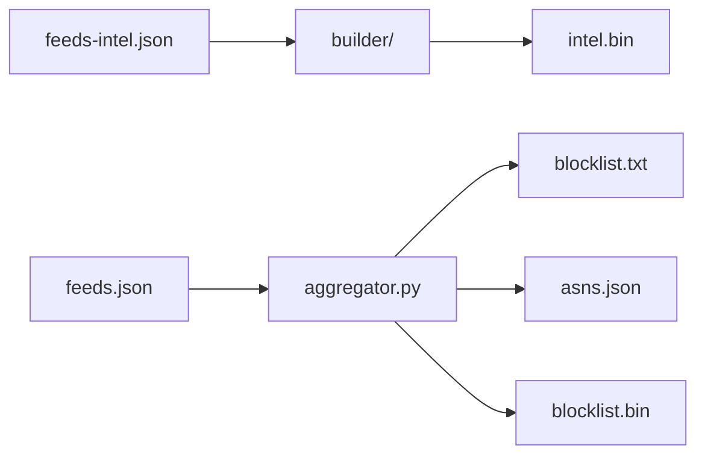

# IPBlocklist

[](https://github.com/tn3w/IPBlocklist/actions)
[](feeds-intel.json)
[](LICENSE)

Aggregates IP/ASN threat intelligence into a single ~30 MB mmap-friendly
database with 0–100 maliciousness scoring (consumer-side).

```bash
wget https://github.com/tn3w/IPBlocklist/releases/latest/download/intel.bin
```

Live demo: [ipblocklist.tn3w.dev](https://ipblocklist.tn3w.dev).

## Artifacts

| file            | role                                       |
| --------------- | ------------------------------------------ |
| `intel.bin`     | primary, columnar mmap, 20-flag bitmask    |
| `blocklist.txt` | scored, CIDR-minimized text for firewalls  |
| `asns.json`     | ASN lists keyed by feed name               |
| `blocklist.bin` | legacy IPBL v2 (scoring + categories)      |

# intel.bin

Built by `builder/` (Rust) from `feeds-intel.json`. SoA columnar layout.
Scoring is consumer-side.

## Layout

256-byte little-endian header. Version 6. IPv4 ranges split by /16
prefix: ranges fitting in one /16 stored as `(start_lo u16, len u16,
val u16)` = 6B; ranges crossing /16 go to overflow table with full u32.

| offset | size | field                |
| -----: | ---- | -------------------- |
|      0 | u32  | version (6)          |
|      4 | u32  | reserved             |
|      8 | u64  | v4_compact_count     |
|     16 | u64  | v4_large_count       |
|     24 | u64  | v6_count             |
|     32 | u64  | val_count            |
|     40 | u64  | str_count            |
|     48 | u64  | v4_bucket_off        |
|     56 | u64  | v4_starts_lo_off     |
|     64 | u64  | v4_lens_off          |
|     72 | u64  | v4_vals_off          |
|     80 | u64  | v4_large_starts_off  |
|     88 | u64  | v4_large_ends_off    |
|     96 | u64  | v4_large_vals_off    |
|    104 | u64  | v6_starts_off        |
|    112 | u64  | v6_ends_off          |
|    120 | u64  | v6_vals_off          |
|    128 | u64  | val_table_off        |
|    136 | u64  | str_index_off        |
|    144 | u64  | str_data_off         |
|    152 | u64  | str_data_len         |

Sections:

- `v4_bucket`: `65537 × u32` — cumulative row offset per /16 bucket.
  Bucket `b` occupies compact rows `[bucket[b], bucket[b+1])`.
- compact `v4_starts_lo`, `v4_lens`, `v4_vals`: `v4_compact_count × u16`
  each. Sorted by `(bucket, start_lo)`. Range is `[prefix|start_lo,
  prefix|(start_lo+len)]` where `prefix = bucket << 16`.
- large `v4_large_starts`, `v4_large_ends`: `v4_large_count × u32`,
  sorted by start. `v4_large_vals`: `× u16`. Holds ranges spanning
  multiple /16s.
- `v6_starts`, `v6_ends`: `v6_count × u128`, sorted by start.
- `v6_vals`: `v6_count × u16`.
- value table: `val_count × {flags u32, provider_id u32, source_id u32,
  _pad u32}` (16B).
- string index + string data: as before.

Flag bits (LSB→MSB): `vpn, proxy, tor, malware, c2, scanner, brute_force,
spammer, compromised, datacenter, cdn, anycast, crawler, bot, cloud,
private_relay, anonymizer, mobile, isp, government`.

`max_ends` (prefix-max of ends) computed at load and kept in RAM:
per-bucket for compact, global for large and v6.

Lookup v4(ip): bucket = ip>>16, ip_lo = ip&0xFFFF. Bisect compact
bucket on `starts_lo`, scan back while `max_ends_lo[i] >= ip_lo`. Also
bisect large globally. Each value's `score` (max flag severity, 0–95)
is computed on demand from `flags`.

## Build

```bash
cd builder
cargo build --release
FEEDS_FILE=../feeds-intel.json OUT_FILE=../intel.bin \
  ./target/release/builder update
./target/release/builder check 1.2.3.4
./target/release/builder bench 100000
```

Produces:
- `target/release/builder` — CLI
- `target/release/libipintel.so` / `libipintel.a` — C-ABI library
- `include/ipintel.h` — C header

ASN→prefix and ASN→org are resolved offline from an `asndb-mini.bin`
(via `ASNDB_FILE` env, downloaded by the workflow). HTTP cache:
`request_cache/`.

## C ABI (web-server integration)

mmap'd, zero-copy load; safe to share one `ipintel_db*` across threads
for read-only lookups.

```c
#include "ipintel.h"

ipintel_db* db = ipintel_open("intel.bin");

uint32_t ip = (192u<<24)|(168u<<16)|(1u<<8)|1u;
uint8_t  score  = ipintel_lookup_v4_score(db, ip);
uint32_t flags  = ipintel_lookup_v4_flags(db, ip);
uint8_t  action = ipintel_lookup_v4_action(db, ip, /*block*/80, /*chal*/35);

uint8_t ipv6[16] = {0x20,0x01,0xdb,0x8,/*...*/};
uint8_t v6score = ipintel_lookup_v6_score(db, ipv6);

ipintel_close(db);
```

`ipintel_lookup_v4_action` returns `IPINTEL_ALLOW` (0),
`IPINTEL_CHALLENGE` (1), or `IPINTEL_BLOCK` (2). `score` is 0–95
(max severity of any matching flag); web servers pick thresholds.

## feeds-intel.json

Top-level: `{ "flags": [...], "feeds": [...] }`. Per-source:

- `name` (required)
- `flags` (subset of the 20 canonical flags)
- `url` + `regex` for IP/CIDR sources
- `is_asn: true` with `asns` (static) or `url`+`regex` (remote)
- `provider` (optional)

## Python lookup

```bash
python3 lookup.py 185.220.101.1
```

### Scoring

- Per-flag severity: `malware`/`c2`=95, `compromised`=75, `brute_force`=70,
  `spammer`=65, `scanner`=55, `tor`=45, `bot`=40, `anonymizer`=35,
  `vpn`=30, `proxy`=25, `private_relay`/`datacenter`=15,
  `cloud`/`crawler`=10, `cdn`=5, `anycast`/`mobile`/`isp`/`government`=0.
- Rarity: `severity × (1 + log2(1/prevalence) / 24)`.
- Top + 15% of remaining; multi-source boost `× (1 + 0.08·log2(sources+1))`.
- Capped at 100. Levels: `critical ≥80`, `high ≥60`, `medium ≥35`,
  `low ≥15`, else `minimal`.

20k v4 sample → Spearman 0.94, Pearson 0.83 vs top-flag severity.

# blocklist.txt

Scored ranges, thresholded, CIDR-promoted, non-routable stripped. Forms
per line: `1.2.3.4`, `1.2.3.0/24`, `1.2.3.1-1.2.3.254`, `2001:db8::1`,
`2001:db8::/32`.

```bash
ipset create blocklist hash:net
grep -v '^#' blocklist.txt | xargs -n1 ipset add blocklist
```

# Pipeline



# Deprecated: blocklist.bin

IPBL v2 self-describing binary with scoring and categories. Kept for
legacy consumers; new integrations should use `intel.bin`. Built from
`feeds.json`.

```text
[4 magic "IPBL"][1 version=2][4 timestamp LE]
[1 flag_count] flag_count × { [1 len][N utf-8] }
[1 cat_count]  cat_count  × { [1 len][N utf-8] }
[2 feed_count LE]
feed_count × {
  [1 len][N name]
  [1 base_score 0-200][1 confidence 0-200]
  [4 flags bitmask LE][1 cats bitmask]
  [4 range_count LE]
  range_count × { [varint start_delta][varint size] }
}
```

Lookup implementations for 25 languages live in `examples/`.

# License

[Apache-2.0](LICENSE).
