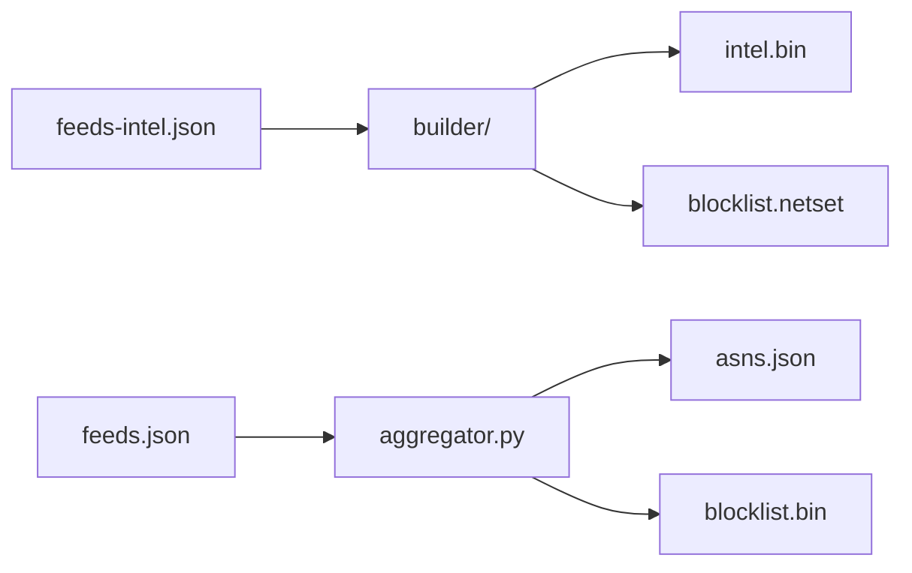

# IPBlocklist

[](https://github.com/tn3w/IPBlocklist/actions)
[](feeds-intel.json)
[](LICENSE)

Aggregated IP/ASN threat intel. ~20 MB mmap DB + ~5 MB netset blocklist.
Consumer-side 0-100 scoring.

```bash
wget https://github.com/tn3w/IPBlocklist/releases/latest/download/intel.bin
wget https://github.com/tn3w/IPBlocklist/releases/latest/download/blocklist.netset
```

Demo: [ipblocklist.tn3w.dev](https://ipblocklist.tn3w.dev).

## Artifacts

| file | role |
| ---- | ---- |
| `intel.bin` | columnar mmap DB, 20-flag bitmask |
| `blocklist.netset` | CIDR netset with metadata header |
| `asns.json` | ASN lists by feed |
| `blocklist.bin` | legacy IPBL v2 |

# intel.bin

Built by `builder/` (Rust) from `feeds-intel.json`. SoA columnar.

## Layout

256B LE header, version 6. IPv4 split by /16: in-bucket ranges as
`(start_lo u16, len u16, val u16)` (6B); cross-/16 ranges in overflow
with full u32.

| offset | size | field |
| -----: | ---- | ----- |
| 0 | u32 | version (6) |
| 4 | u32 | reserved |
| 8 | u64 | v4_compact_count |
| 16 | u64 | v4_large_count |
| 24 | u64 | v6_count |
| 32 | u64 | val_count |
| 40 | u64 | str_count |
| 48..152 | u64 × 13 | section offsets + str_data_len |

Sections:

- `v4_bucket`: `65537 × u32`, cumulative row offset per /16.
- compact `starts_lo`, `lens`, `vals`: `v4_compact_count × u16`, sorted
  by `(bucket, start_lo)`. Range = `[prefix|start_lo, prefix|(start_lo+len)]`.
- large `starts`, `ends`: `× u32`. `vals`: `× u16`. Cross-/16 ranges.
- v6: `starts`, `ends`: `× u128` sorted. `vals`: `× u16`.
- values: `val_count × {flags u32, provider_id u32, source_id u32, _pad u32}`.
- string index + data.

Flags (LSB first): `vpn, proxy, tor, malware, c2, scanner, brute_force,
spammer, compromised, datacenter, cdn, anycast, crawler, bot, cloud,
private_relay, anonymizer, mobile, isp, government`.

Prefix-max of ends computed at load (per-bucket compact; global large/v6).

Lookup v4: `bucket = ip>>16, lo = ip&0xFFFF`. Bisect compact bucket on
`starts_lo`; scan back while `max_ends_lo[i] >= lo`. Bisect large globally.
`score` = max flag severity (0-95), computed on demand.

## Build

```bash
cd builder
cargo build --release
FEEDS_FILE=../feeds-intel.json OUT_FILE=../intel.bin \
  ./target/release/builder update
./target/release/builder check 1.2.3.4
./target/release/builder bench 100000
./target/release/builder blocklist 40 cidr   # range also valid
./target/release/builder analyze
./target/release/builder sweep
```

Produces: `builder` CLI, `libipintel.so`/`.a`, `include/ipintel.h`.

ASN resolved offline from `asndb-mini.bin` (`ASNDB_FILE` env). HTTP cache:
`request_cache/`.

## C ABI

mmap, zero-copy, share one `ipintel_db*` across threads (read-only).

```c
#include "ipintel.h"
ipintel_db* db = ipintel_open("intel.bin");
uint32_t ip = (192u<<24)|(168u<<16)|(1u<<8)|1u;
uint8_t  s = ipintel_lookup_v4_score(db, ip);
uint32_t f = ipintel_lookup_v4_flags(db, ip);
uint8_t  a = ipintel_lookup_v4_action(db, ip, 80, 35);
ipintel_close(db);
```

`*_action` returns `ALLOW` (0), `CHALLENGE` (1), `BLOCK` (2).

## feeds-intel.json

`{ "flags": [...], "feeds": [...] }`. Per source: `name`, `flags`
(subset of 20), `url`+`regex`, or `is_asn: true` + `asns`/`url+regex`,
optional `provider`.

## Python lookup

```bash
python3 lookup.py 185.220.101.1
```

## golf/

Compact, self-contained ports of the loader+lookup across many languages.
Same JSON output as `lookup.py`, same scoring. Run `intel.<ext>` directly
(or compile per the language's conventions); each script reads `../intel.bin`.

Severities: `malware`/`c2`=95, `compromised`=75, `brute_force`=70,
`spammer`=65, `scanner`=55, `tor`=45, `bot`=40, `anonymizer`=35,
`vpn`=30, `proxy`=25, `private_relay`/`datacenter`=15, `cloud`/`crawler`=10,
`cdn`=5, rest 0.

Score: `severity × (1 + log2(1/prevalence)/24)`, top + 15% of rest,
multi-source boost `× (1 + 0.08·log2(sources+1))`, capped at 100.
Levels: `critical >=80`, `high >=60`, `medium >=35`, `low >=15`, else `minimal`.

20k sample: Spearman 0.94, Pearson 0.83 vs top-flag severity.

# blocklist.netset

Plain-text CIDR list with `#`-prefixed metadata header, emitted by
`builder update`. CIDR is universal (iptables/ipset/nftables/ufw/pfSense).
Pass `range` for `start-end` form.

Pipeline: iter intel.bin ranges, filter `max_severity >= threshold`,
sort+merge, emit. Single IPs collapse to bare addr.

Default threshold **40** (`BLOCKLIST_THRESHOLD` env): malware/c2/compromised
/brute_force/spammer/scanner/tor/bot. ~5.4 MB, 685M IPs. Below 40
anonymizer/vpn add ASN-wide ranges (4x size, poor signal); above 55 drops
to ~1-3 MB but misses scanners/tor. `builder sweep` prints the full table.

```bash
ipset create blocklist hash:net
awk '!/^#/' blocklist.netset | xargs -n1 ipset add blocklist
```

# Pipeline



# Deprecated: blocklist.bin

IPBL v2 binary. Legacy; new integrations use `intel.bin`. Built from
`feeds.json`.

```text
[4 magic "IPBL"][1 version=2][4 timestamp LE]
[1 flag_count]  × { [1 len][N utf-8] }
[1 cat_count]   × { [1 len][N utf-8] }
[2 feed_count LE]
feed_count × {
  [1 len][N name]
  [1 base_score 0-200][1 confidence 0-200]
  [4 flags LE][1 cats]
  [4 range_count LE]
  range_count × { [varint start_delta][varint size] }
}
```

25-language lookup examples in `examples/`.

# License

[Apache-2.0](LICENSE).
